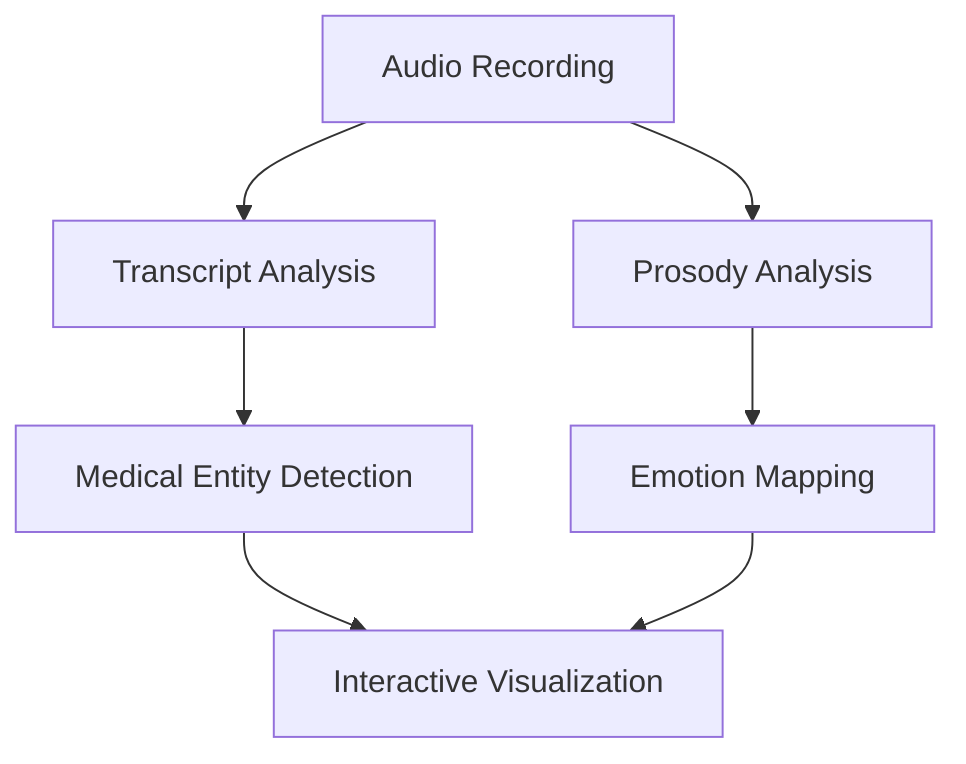
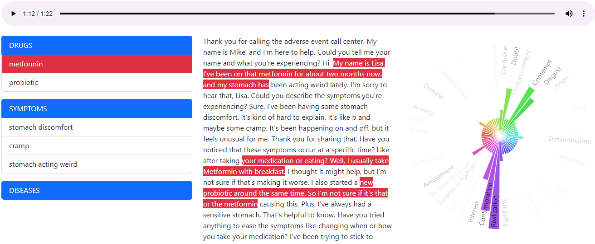

# Patient Pulse

An AI-powered tool that analyzes patient call recordings from clinical trials to identify drugs, diseases, symptoms, and emotional patterns.

## Overview

Patient Pulse processes audio recordings of patient calls to extract key medical information and emotional insights. It combines speech analysis with emotion detection to provide a comprehensive view of patient interactions.





## Features

- **Medical Entity Recognition**: Identifies drugs, diseases, and symptoms mentioned in calls
- **Emotion Analysis**: Maps prosodic features to Plutchik's 8 basic emotions
- **Interactive Visualization**:
  - Real-time audio playback with synchronized transcript
  - Dynamic emotion radar chart overlaid on Plutchik's wheel
  - Highlighted current sentence during playback
  - Interactive timeline slider for navigation
- **Dark Mode Support**: Auto/light/dark theme options
- **Mobile-Responsive**: Bootstrap 5.3 interface

## Usage

1. Select a patient call recording from the available transcripts
2. The application will:
   - Play the audio recording
   - Display the synchronized transcript
   - Show emotional patterns on Plutchik's wheel
   - Highlight medical entities in the text
3. Use the audio controls to:
   - Play/pause the recording
   - Navigate through the timeline
   - Jump to specific sections

## Setup

### Prerequisites

- Modern web browser with JavaScript enabled
- Access to LLM Foundry API endpoints
- Hume.ai API access for prosody analysis

### Local Setup

1. Clone this repository:

```bash
git clone https://github.com/gramener/patientpulse.git
cd patientpulse
```

2. Serve the files using the static auth server:

```bash
uvx https://raw.githubusercontent.com/sanand0/staticauth/main/app.py
```

3. Open `http://localhost:8000` in your browser

## Adding New Recordings

1. Convert audio to MP3 format with lowercase hyphenated filename
2. Process through Hume.ai platform for prosody analysis
3. Extract and rename prosody CSV file
4. Compress audio to OPUS format
5. Add entry to `config.json`:

```json
{
  "title": "Recording Title",
  "audio": "audio/filename.opus",
  "prosody": "audio/filename.prosody.csv"
}
```

## Technical Details

### Architecture

- Frontend: Vanilla JavaScript with lit-html for rendering
- Audio Processing: Hume.ai Expression Models
- Medical Analysis: GPT-4o-mini via LLM Foundry
- Styling: Bootstrap 5.3.3 with dark mode

### Dependencies

- lit-html - Template rendering
- d3.js - Emotion wheel visualization
- Bootstrap - UI framework and styling
- Bootstrap Icons - Icon system

## License

[MIT](LICENSE)
